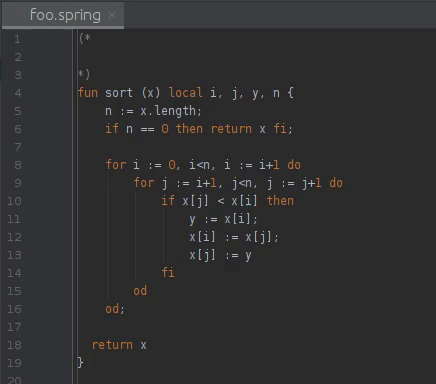

# Rider plugin for a [fictional programming language](https://github.com/demarkok/compiler)



## Language description
Language is pretty simple but includes all the basic constructions such as __loops, functions, procedures, arrays, strings, pattern matching__.
### Syntax example

#### Fibonacci
```
fun fib (n) local r {
  if n <= 1
  then result := 1
  else
    fib (n-1);
    r := result;
    fib (n-2);
    result := result + r
  fi
}

n := read();

fib(n);
write (result)
```

#### Sum of the list
```
fun sum (x) {
  case x of
    `nil          -> return 0
  | `cons (x, tl) -> return x + sum (tl)
  esac
}

x := read ();

write (sum (`cons (100, `cons (200, `nil))))
```

#### Buuble sort
```
fun sort (x) local i, j, y, n {
  n := x.length;
  
  if n == 0 then return x fi;
  
  for i := 0, i<n, i := i+1 do
    for j := i+1, j<n, j := j+1 do
      if x[j] < x[i] then
         y    := x[i];
	 x[i] := x[j];
	 x[j] := y
      fi
    od
  od;
  
  return x
}

n := read ();
x := [10, 9, 8, 7, 6, 5];

x := sort (x);

for i:=0, i<x.length, i:=i+1 do
  write (x[i])
od
```

## Building the plugin

### Requirements

* [.NET Framework 4.6.1 Developer Pack](https://www.microsoft.com/en-us/download/details.aspx?id=49978)
* [.NET Core SDK 2.0+](https://www.microsoft.com/net/download/windows)
* [JDK 1.8](http://www.oracle.com/technetwork/java/javase/downloads/jdk8-downloads-2133151.html)

### Optional

* [IntelliJ IDEA](https://www.jetbrains.com/idea/)
* [JetBrains Rider](https://www.jetbrains.com/rider/) or a different .NET IDE

### Building the plugin and launching Rider in a sandbox 

1. Install SDK and prepare backend plugin build using Gradle
    * if using IntelliJ IDEA:

	     Open the `rider-spring` project in IntelliJ IDEA. When suggested to import Gradle projects, accept the suggestion: Gradle will download Rider SDK and set up all necessary dependencies. `rider-spring` uses the [gradle-intellij-plugin](https://github.com/JetBrains/gradle-intellij-plugin) Gradle plugin that downloads the IntelliJ Platform SDK, packs the plugin and installs it into a sandboxed IDE or its test shell, which allows testing the plugin in a separate environment.

	     Open the *Gradle* tool window in IntelliJ IDEA (*View | Tool Windows | Gradle*), and execute the `rider-spring/prepare` task.

    * if using Gradle command line:

        ```
        $ cd ./rider-spring
        $ ./gradlew prepare
        ```

2. Open `Spring.sln` solution and build using the `Debug` configuration. The output assemblies are later copied to the frontend plugin directories by Gradle. (If you're seeing build errors in Rider, choose *File | Settings | Build, Execution, Deployment | Toolset and Build*, and in the *Use MSBuild version* drop-down, make sure that Rider uses MSBuild shipped with .NET Core SDK.)

3. Launch Rider with the plugin installed

    * if using IntelliJ IDEA:

        Open the *Gradle* tool window in IntelliJ IDEA (*View | Tool Windows | Gradle*), and execute the `intellij/runIde` task. This will build the frontend, install the plugin to a sandbox, and launch Rider with the plugin.

    * if using Gradle command line:

        ```
        $ ./gradlew runIde
        ```

### Installing to an existing Rider instance

1. Build the `Debug` configuration in `Spring.sln`.
2. Execute the `buildPlugin` Gradle task.
3. Install the plugin (`rider-spring/build/distributions/*.zip`) to your Rider installation [from disk](https://www.jetbrains.com/help/idea/installing-a-plugin-from-the-disk.html).

